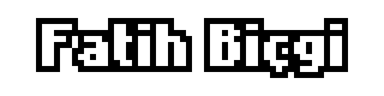

## Unity3d Repositories
[)](https://github.com/fatihBicgi/elemental-calibration-game.git)
[)](https://github.com/fatihBicgi/2d-zombie-shooter.git)
[)](https://github.com/fatihBicgi/living-city-animation.git)
[)](https://github.com/fatihBicgi/2d-game-presentation.git)
[)](https://github.com/fatihBicgi/pandemic-annihilation-game.git)

## Flutter Repositories
[)](https://github.com/fatihBicgi/Bildir.git)

## Stats

## Languages

